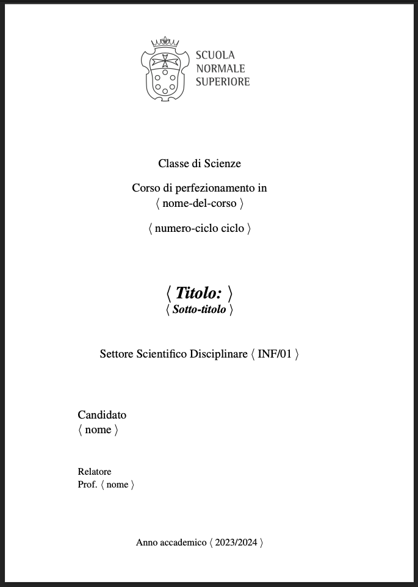

# Unofficial SNS PhD Thesis Template

This repository contains a LaTeX template for writing your PhD thesis. 
The template aims to replicate the formatting and style of the _frontespizio_ produced by Ser.Se, the online portal for submitting theses of the Scuola Normale Superiore, Pisa, Italy.

## Sample output with some additional personalizations

## Features
- Replicates the style of _frontespizio_ produced by Ser.Se.
- Includes options in the Makefile to compile different versions of the thesis:
  - **Draft Version**: A simple draft version without images for fast compilation.
  - **Roboto-like Font Frontespizio**: A version with a Roboto-like font for the frontespizio, as it appears on Ser.Se.
  - **Default LaTeX Template**: A prettier version with the default LaTeX template.

## Usage
1. Clone this repository: `git clone https://github.com/philipjk/sns-thesis.git`.
2. Navigate to the repository: `cd sns-thesis`.
3. Edit the LaTeX files to write your thesis.
4. Use the Makefile to compile your thesis:
   - For the draft version, run: `make draft`.
   - For the Roboto-like font frontespizio version, run: `make roboto`.
   - For the default LaTeX template version, run: `make pdf`.
5. Find the compiled PDF in the `output` directory.
6. To clean up your directory, run `make clean`.

## Requirements
- LaTeX distribution (e.g., TeX Live, MiKTeX).
- Make utility (usually available on Unix-based systems, for Windows users, consider using MinGW or WSL).

## Contributing
Contributions are welcome! If you find any issues or have suggestions for improvements, please open an issue or create a pull request.
